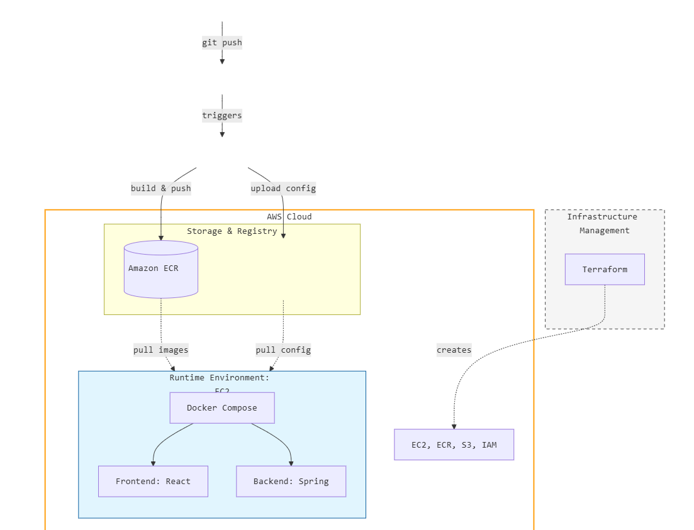

WPOMS :- Warranty And Purchase Order Management System

Project Overview

WPOMS is a web application with user type Manufacturer, Vendor and Customer for warranty and purchase order management, built with a React frontend, Spring Boot backend, and PostgreSQL database. The application is containerized using Docker and automatically deployed to AWS using a CI/CD pipeline with GitHub Actions.

Architecture Diagram :-

Run Locally:-

Clone repository :- git clone <repository-url>

Start containers :- docker compose up -d

Open application :-

Frontend :- http://localhost:5173

Backend :- http://localhost:8081

How the pipeline works :-

When code is pushed to the main branch, GitHub Actions starts automatically. The pipeline first checks out the source code and configures AWS credentials. It then builds Docker images separately for frontend and backend applications and tags each image using a unique image tag generated from the commit ID.

The images are pushed into Amazon ECR. The workflow uploads docker-compose file to S3 and connects to the EC2 instance through SSH. On EC2, deployment commands download configuration files, authenticate with ECR, pull the newest Docker images, and restart the containers using Docker Compose.
After deployment, the workflow performs health checks using curl commands and fails automatically if the application is unavailable.

How to debug a failed pipeline :-
Check GitHub Actions logs

Open :- GitHub Repository → Actions → Failed workflow

Check :-
Build errors
Docker image push failures
AWS authentication failures
Deployment failures
Check EC2 container status

SSH into EC2:
docker ps -a

View container logs
Backend logs:

docker logs app-backend-1

Frontend logs:

docker logs app-frontend-1

Database logs:

docker logs app-db-1

Check Docker Compose status
docker compose ps

Test services manually

Frontend :-
curl -I http://localhost:5173

Backend :-
curl -I http://localhost:8081/actuator/health

Live URL :-
http://15.206.124.215:5173

